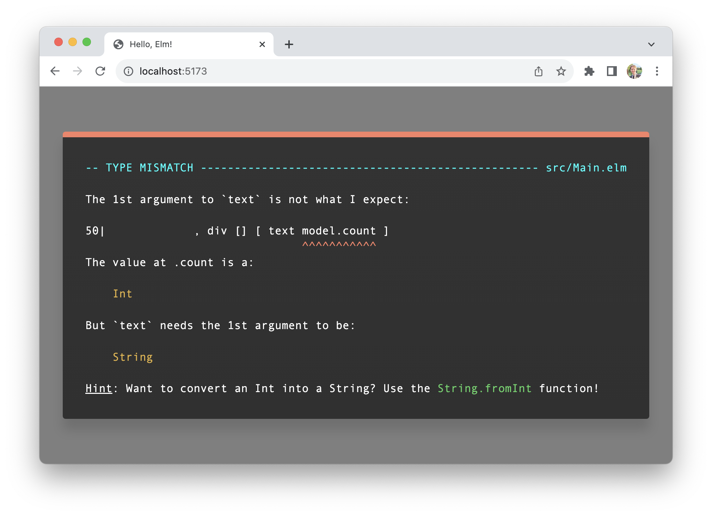

# vite-plugin-elm-watch

Use Vite with Elm projects!

## Installation

```bash
npm install -D elm vite-plugin-elm-watch
```

## Usage

```js
// vite.config.js
import { defineConfig } from 'vite'
import ElmWatchPlugin from 'vite-plugin-elm-watch'

export default defineConfig({
  plugins: [ElmWatchPlugin()]
})
```

```js
// In src/main.js
import Elm from './src/Main.elm'

let app = Elm.Main.init()
```

## Features

- __Import `*.elm` files__ in JavaScript files
- __Hot reloading__ powered by [_elm-watch_](https://lydell.github.io/elm-watch/)!
- __Full-color__ Elm error messages in the browser
- __Minification__ automatically applied for production builds




## Options

There are a few ways you can customize this plugin's behavior.

```ts
type Options = {
  // Default: 'auto'
  mode: 'auto' | 'standard' | 'debug' | 'optimize' | 'minify'
  // Default: false
  isBodyPatchEnabled: boolean
}
```

### `mode`

When using [the official Elm CLI](https://guide.elm-lang.org/install/elm.html), you have access to flags that 
can add Elm's debugger, or optimize your code for production.

This plugin adds 

```ts
  'auto'     // Uses "debug" in development and "minify" in production
| 'standard' // Doesn't add any Elm compiler flags
| 'debug'    // Adds the `--debug` flag
| 'optimize' // Adds the `--optimize` flag
| 'minify'   // Adds the `--optimize` flag and minifies the JS output
```


### `isBodyPatchEnabled`

```ts
type Options = {
  // ...,
  isBodyPatchEnabled : boolean
}
```

In production, you might encounter issues caused by third party JS that changes the DOM structure underneath Elm. This only is a problem for folks using `Browser.application`, which expects control over the entire `<body>` element.

By setting `isBodyPatchEnabled: true`, you can specify a different root node, using Elm's standard `node` field when initializing an Elm application.

```js
// src/main.js
import Elm from './src/Main.elm'

let app = Elm.Main.init({
  node: document.getElementById('elm_root')
})
```

__Note:__ This will only work if the element has an `id` attribute.


